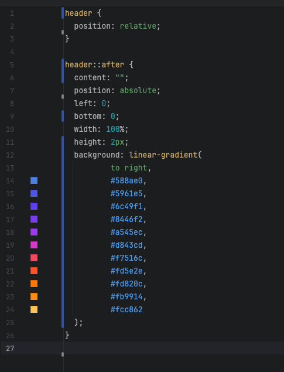

# Gradient from Image

A browser-based tool that extracts CSS gradients from any image. Upload a picture, draw a sample line, and get ready-to-use CSS.

**Try it:** [gradient-from-image.karmanov.ws](https://gradient-from-image.karmanov.ws/)

## The Problem

Sometimes when you work as a freelancer, you may receive a design as a plain image without layers. Such images can contain fancy elements — for example, a gradient line with multiple colors smoothly transitioning into each other. And of course, the original design files are not available.

**Option 1:** Open Photoshop, manually sample colors from several positions, and then convert everything into CSS.

This immediately falls apart because Photoshop costs money, it's an overkill tool for non-designers, and you have to manually measure pixels and copy colors by hand — which is inconvenient.

## The Solution

**Option 2:** This project!

Upload the image to the site, configure the line along which the colors should be sampled, copy the generated CSS — and you're good to go.

> No server-side processing, no tracking — everything works entirely in the browser.
